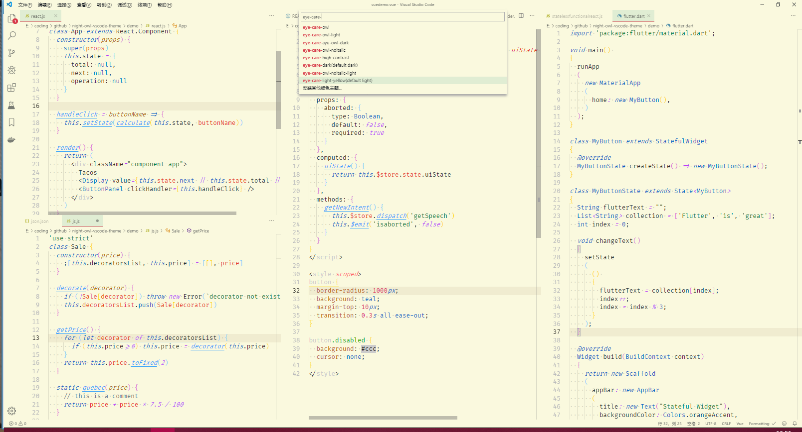

# Eye Care

A Visual Studio Code theme.

## Installation

1.  Install [Visual Studio Code](https://code.visualstudio.com/)
2.  Launch Visual Studio Code
3.  Choose **Extensions** from menu
4.  Search for `Eye Care Themes`
5.  Click **Install** to install it
6.  Click **Reload** to reload the Code
7.  From the menu bar click: Code > Preferences > Color Theme > **eye-care**

## Screenshots

### Dark

### Light

## Thanks

- [Night Owl](https://marketplace.visualstudio.com/items?itemName=sdras.night-owl)
- [Ayu Mirage](https://marketplace.visualstudio.com/items?itemName=teabyii.ayu)
